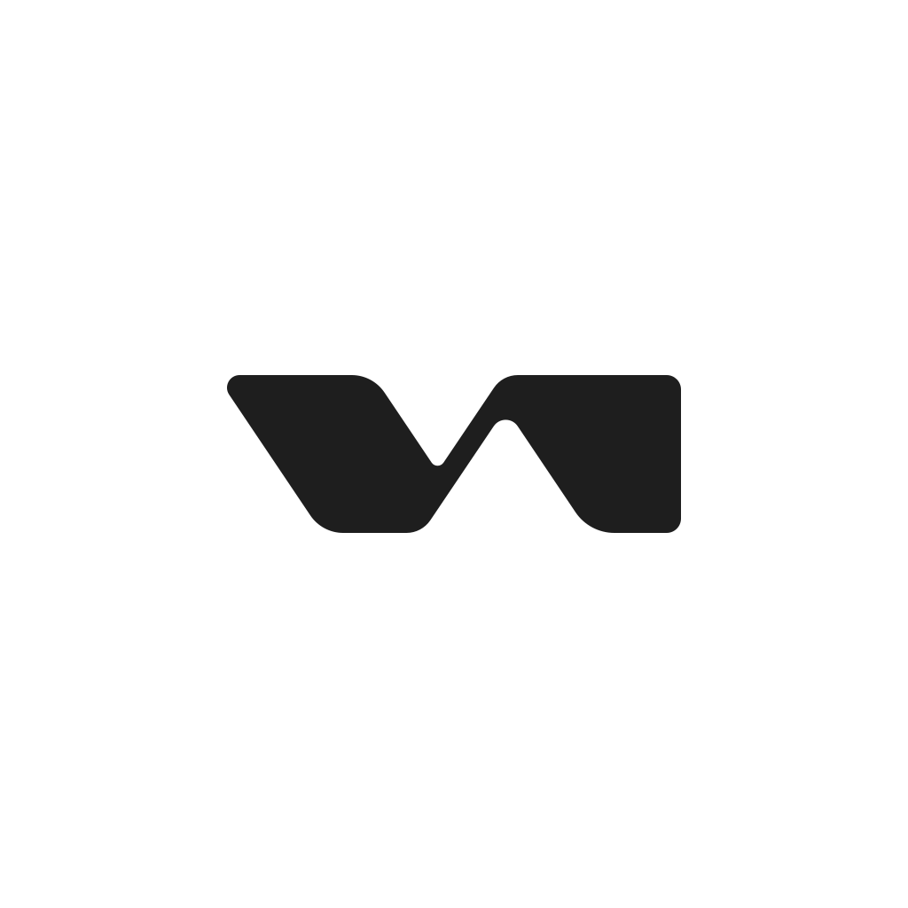

<div align="center">
  
  
  <h1>Velnorr - DynamicIsland for macOS</h1>

  <p>A polished, responsive media and system status experience for the macOS menu bar.</p>
  
  <p>
    
    
    
    
  </p>
</div>

<hr>

## Overview

Velnorr brings a compact, animated status surface to macOS. It adapts to MacBooks with a physical notch and to notchless displays, while keeping the desktop underneath fully usable through shape-aware mouse passthrough.

The interface stays quiet when nothing needs attention and expands naturally when you hover, interact with media, change volume or brightness, connect a device, or receive a battery event.

The expanded music panel closes with an animation after three seconds of pointer-free inactivity.

When the macOS session is locked, Velnorr keeps the Dynamic Island visible with a lock icon on its left side and a configurable SF Symbol on its right, then presents the active music controls in a native SwiftUI Liquid Glass widget 36 pt above the login avatar. Unlocking removes the lock-screen widget and restores the normal interaction surface. This uses AppKit's login-window visibility plus a dynamically loaded SkyLight lock-screen Space, so availability can vary with macOS system updates; Velnorr falls back to the AppKit window level if SkyLight is unavailable.

## Screenshots

<p align="center">
  <strong>Music Panel</strong>
</p>

<p align="center">
  
</p>

<br>

<p align="center">
  <strong>Default HUD</strong>
</p>

<p align="center">
  
</p>

## Highlights

<table>
  <tr>
    <td width="50%">
      <strong>Now Playing</strong><br>
      Spotify and Apple Music artwork, track metadata, progress, seek, playback and navigation controls.
    </td>
    <td width="50%">
      <strong>Adaptive displays</strong><br>
      Physical-notch geometry plus configurable pill and simulated-notch modes for external displays.
    </td>
  </tr>
  <tr>
    <td>
      <strong>System HUDs</strong><br>
      Animated volume, brightness and Caps Lock feedback with configurable visibility and durations. Hover and drag the volume or brightness bar to adjust it directly.
    </td>
    <td>
      <strong>Battery events</strong><br>
      Charging, unplugged, low battery, full charge and threshold-change notifications with level-aware color.
    </td>
  </tr>
  <tr>
    <td>
      <strong>Connected devices</strong><br>
      AirPods, Apple Watch, keyboards, mice/trackpads and speakers with Bluetooth battery details.
    </td>
    <td>
      <strong>Designed to be personal</strong><br>
      A macOS-style Settings window, profiles, preview mode, reduced motion and extensive appearance controls.
    </td>
  </tr>
  <tr>
    <td>
      <strong>Utility panels</strong><br>
      Calendar and Reminders glance view, a bounded persistent Shelf for files/links/text, Quick Look/Finder/share actions, and a permission-aware camera Mirror panel.
    </td>
    <td>
      <strong>Low-overhead interaction</strong><br>
      Demand-driven utility services, event-based updates and adaptive pointer handling keep inactive panels quiet. Optional vertical swipe gestures open and dismiss the surface with Reduce Motion support.
    </td>
  </tr>
</table>

## Requirements

- macOS 13 Ventura or later
- Swift 6 toolchain (included with current Xcode or Swift toolchain installation)
- Spotify and/or Apple Music for media controls

Velnorr uses Apple Events to read and control supported media players. macOS may ask for Automation permission the first time a player is accessed.

Calendar, Reminders and Mirror are optional. Their macOS permissions can be requested during setup or from the corresponding panel/settings page. Mirror stops its capture session when the panel is dismissed. Shelf files are stored as security-scoped bookmarks; text and links are stored locally with bounded size and item counts. Shelf items can be opened, previewed in Quick Look, revealed in Finder, shared through the macOS share picker, copied as a path, dragged out, or removed.

## Install

### DMG (recommended)

Build the distributable app and disk image from the project root:

```sh
CODE_SIGN_IDENTITY="Developer ID Application: Your Name (TEAMID)" \
  ./Packaging/build_dmg.sh --distribution
```

Open `dist/Velnorr-1.0.0.dmg`, then drag `Velnorr.app` into `Applications`.

The distribution mode requires a Developer ID certificate and performs local
app/DMG signature and integrity verification. Notarize and staple the DMG with
Apple before publishing it. For local validation without a Developer ID
certificate, run `./Packaging/build_dmg.sh` instead.

### Build from source

```sh
git clone <your-repository-url>
cd velnorr
./Packaging/build_dmg.sh --run
```

The `--run` mode builds and launches a signed `Velnorr.app` bundle. Use this
mode when testing Mirror: macOS records camera permission by application
bundle, so launching the raw `swift run` executable can make the permission
appear under Terminal instead of Velnorr. The generated app is at
`dist/Velnorr.app`.

## Run

Start the development app with:

```sh
./Packaging/build_dmg.sh --run
```

The app is a menu-bar utility, so it does not open a conventional main window on launch. Use the Velnorr context menu to open Settings, Calendar, Shelf or Mirror, or to quit the app. A long press on the center notch also opens Calendar.

## Preview mode

Preview command-line states without changing real hardware or repeatedly connecting devices:

These preview-only commands intentionally run the executable directly. Use
`./Packaging/build_dmg.sh --run` for Mirror or any camera-permission test.

```sh
# Battery states
swift run Velnorr --preview-battery
swift run Velnorr --preview-unplugged
swift run Velnorr --preview-low-battery
swift run Velnorr --preview-full-charge
swift run Velnorr --preview-battery-threshold

# Connected-device states
swift run Velnorr --preview-airpods
swift run Velnorr --preview-keyboard
swift run Velnorr --preview-mouse
swift run Velnorr --preview-speaker
```

Preview mode is also available from Settings → Preview for volume, brightness, Caps Lock and music states.

## Settings

Right-click Velnorr and choose **Settings** to customize:

- General behavior, launch at login and fullscreen visibility
- External display mode and position
- Interface language and system-default language detection
- Animation, artwork size/radius, opacity and theme
- Lock-screen Dynamic Island right-side icon and color
- Now Playing content, waveform and marquee behavior
- Volume, brightness and Caps Lock HUD visibility, styling, timing and size
- Direct volume and brightness adjustment by hovering and dragging their HUD bars
- Battery event types, thresholds, 10% threshold cadence, icon size and notification duration
- Connected-device notification categories and timing
- Calendar event/reminder visibility and Calendar & Reminders permission status
- Shelf Quick Share visibility and maximum saved-item count
- External display style and notch height behavior
- Swipe gestures, close gesture, gesture sensitivity and haptic feedback
- Reduced motion, diagnostics, JSON import/export and saved profiles

The interface is localized for English, Spanish, German, French, Brazilian Portuguese, Italian, Turkish, Japanese, Korean, Simplified Chinese, Traditional Chinese and Arabic. Arabic automatically uses right-to-left layout.

## Architecture

The project is organized as a Swift Package with feature-oriented layers:

```text
Sources/Velnorr/
├── App/          Application lifecycle, settings and notifications
├── Domain/       Presentation state and media models
├── Layout/       Notch, display and adaptive geometry
├── Media/        Media players, artwork, battery, audio and Bluetooth
├── Window/       AppKit window and shape-aware hit testing
├── DesignSystem/ Shared shapes, transitions and animation values
├── Views/Velnorr/ HUD shell and system status surfaces
├── Views/NowPlaying/
├── Views/Utilities/ Calendar, Shelf and Mirror panels
└── Views/Settings/
```

The media layer serializes AppleScript work, polling is sequential, and utility services are owned once by `VelnorrRuntime`. Calendar updates are demand-driven through EventKit notifications, Shelf persistence is bounded and bookmark-based, and the camera session has an explicit start/stop lifecycle. The window shares the same CGPath geometry as the SwiftUI shape to keep rendering and hit testing aligned.

## Development

Run the complete test suite before submitting changes:

```sh
swift test
```

The tests cover layout calculations, source arbitration, media parsing, interaction transitions, mouse policy, artwork transitions, localization catalog completeness and Arabic layout direction.

When adding a user-visible string, add the key to every `Resources/*.lproj/Localizable.strings` file. The localization test intentionally fails when a language catalog is incomplete.

## Packaging notes

`Packaging/build_dmg.sh` creates a self-contained `Velnorr.app`, copies the SwiftPM resource bundle and localization directories into the app bundle, signs it with an available local identity (or ad-hoc signing), and creates `dist/Velnorr-1.0.0.dmg`.

Local development signing is not a substitute for release signing and notarization. Apple Events behavior, launch-at-login registration and permissions should be re-tested with the final signed build.

## Project

Velnorr is designed and developed by **Berkay Huz** at **Huzstudio**.

- [Velnorr](http://huzstudio.com/velnorr)
- [Huzstudio](http://huzstudio.com)
